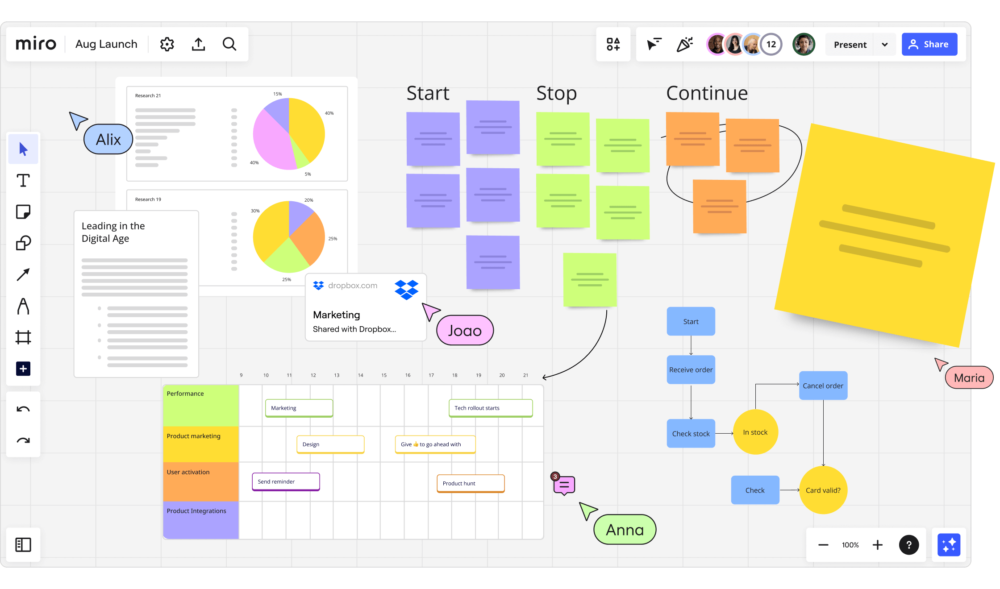

### **What is Miro**?

Miro is a virtual whiteboard that you can use for online classes. The size of the board is unlimited. With Miro, you can make notes, draw, add comments, and upload various materials. In Miro, you can work from scratch or use templates. You can use Miro for an individual online class with your student or to work online with a group.

Four plans are available: **Free, Team Plan, Business Plan, and Enterprise Plan**.

 

