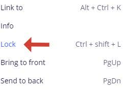

### How to lock an object on the board

To lock an object on the board, you are to:    

1. Right-click the object.

2. Click **Lock** or use **Ctrl + shift + L** to lock the object on the board.

     

  
