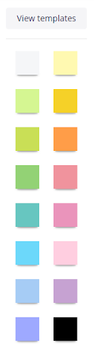
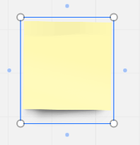

### How to add a sticky note to the board

To add a sticky note to the board, you are to:

1. Click the **Sticky notes** icon.

       

2. Choose the color of your sticky note.

        

3. Click the whiteboard.    

4. To resize the sticky note, click it. On its border, hold the pointer over one of the white circles, drag the pointer ⤡ to make the image larger or smaller.

     

